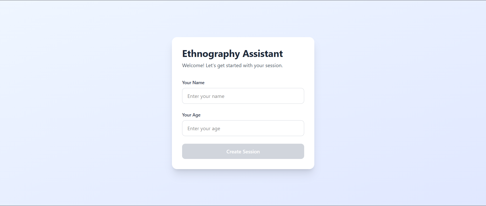
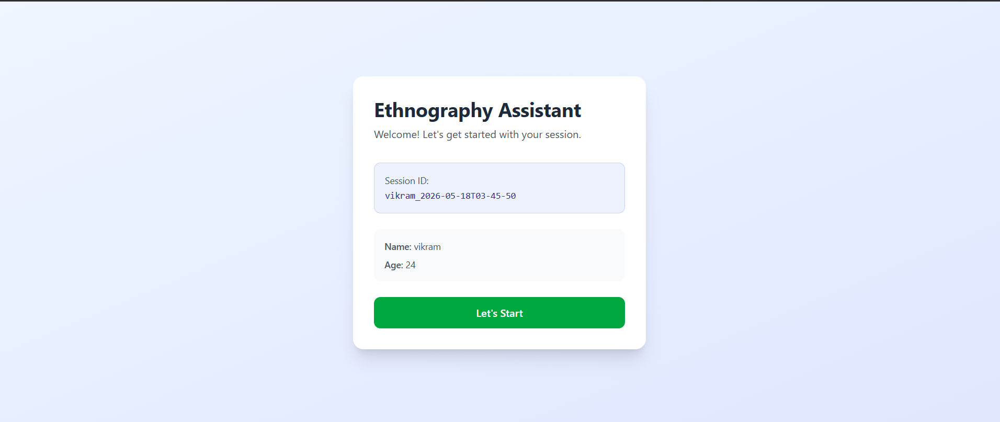
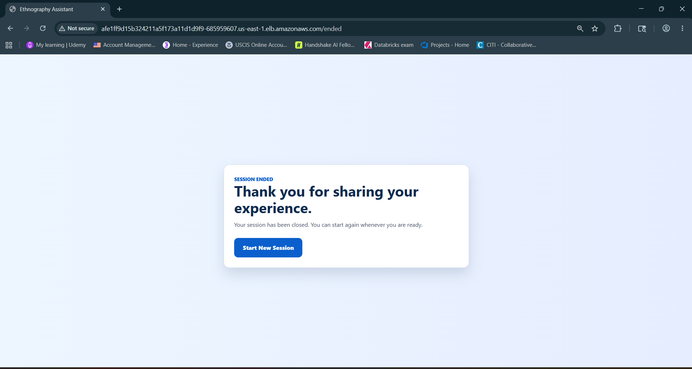
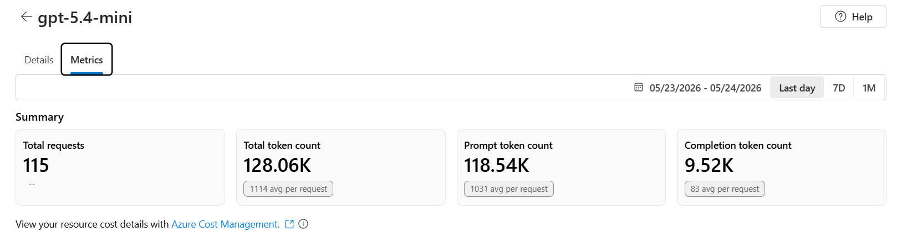
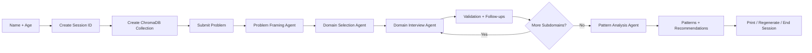
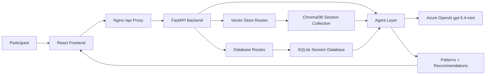
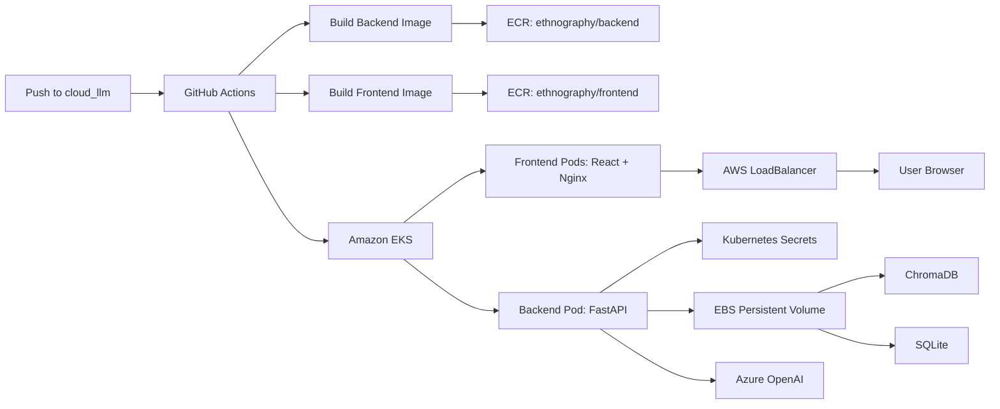
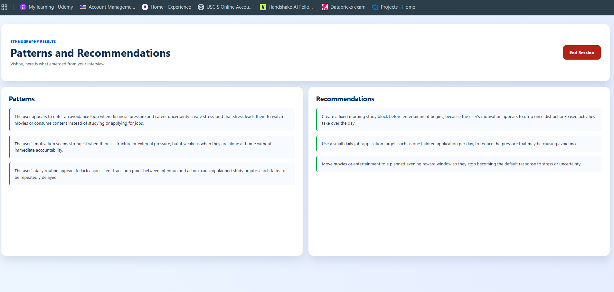
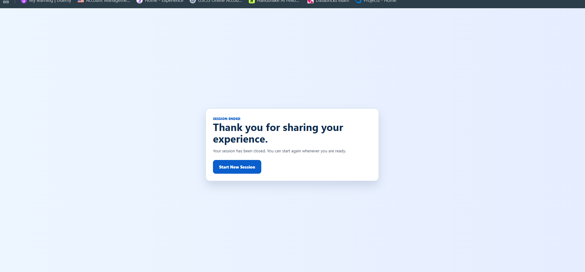

# Ethnography AI Interviewer

Ethnography AI Interviewer is a cloud-deployed, multi-agent qualitative interview application. It guides a participant from an initial problem statement through adaptive domain exploration, answer validation, pattern discovery, and personalized recommendations.

The system combines a React interview interface, a FastAPI backend, Azure OpenAI agents, ChromaDB retrieval memory, SQLite session persistence, Docker containers, GitHub Actions CI/CD, Amazon ECR, and Amazon EKS.

## Product Walkthrough

### 1. Create A Session

The participant starts by entering their name and age. The frontend creates a unique `session_id`, and the backend prepares a session-specific vector collection.



After the session is created, the user sees their generated session ID and can begin the interview.



### 2. Explore Domains And Subdomains

After the problem-framing stage, the system selects relevant domains and subdomains to explore. The exploration screen uses a lean progress timeline on the left and a side-by-side question/answer workspace on the right.

Each hollow circle represents a domain or subdomain. Completed items turn green, making interview progress visible without taking too much screen space.


### 3. Generate Patterns And Recommendations

When all selected domains and subdomains are complete, the user can generate results. The results page separates inferred patterns from actionable recommendations, and includes controls to regenerate, print, or end the session.


### 4. End The Session

When the session ends, the backend deletes the session's temporary ChromaDB vector collection. The participant can start a new session from the closing screen.



### 5. Azure OpenAI Usage

The backend uses an Azure OpenAI deployment for all agent reasoning. Azure metrics show request and token usage for the `gpt-5.4-mini` deployment.



## What The Project Solves

Traditional qualitative interviews often rely on fixed questionnaires. That makes it hard to adapt to a participant's lived experience, notice gaps in answers, or connect insights across the full session.

This project solves that by using AI agents that:

- Clarify the participant's initial problem.
- Select the most relevant domains for exploration.
- Ask targeted questions for each domain and subdomain.
- Validate answers and ask follow-up questions when needed.
- Store useful summaries in retrieval memory.
- Generate final patterns and recommendations from the full interview.
- Record session data so results can be reviewed or printed.

## Core User Flow



## Multi-Agent Architecture

The backend is organized around specialized agents. Each agent owns a clear step in the interview workflow.

| Agent | Purpose | Route |
| --- | --- | --- |
| Problem Framing Agent | Clarifies the user's initial problem and decides whether more context is needed. | `POST /agent/problem-framing` |
| Domain Selection Agent | Selects domains and subdomains that should be explored for the framed problem. | `POST /agent/domain-selection` |
| Domain Interview Agent | Generates questions for the active domain and subdomain. | `POST /agent/start-domain-interview` |
| Validation Agent | Validates the user's answer and generates follow-up questions if the answer is incomplete. | `POST /agent/validate-domain-answer` |
| Pattern Analysis Agent | Synthesizes completed interview context into patterns and recommendations. | `POST /agent/pattern-analysis` |

The agents use LangGraph-style state transitions and call Azure OpenAI through the `AzureOpenAI` client.

## RAG And Memory Design

The system uses two memory layers.

| Memory Layer | Technology | Purpose |
| --- | --- | --- |
| Vector memory | ChromaDB | Stores the user's problem and completed subdomain summaries for retrieval-augmented agent prompts. |
| Structured memory | SQLite | Stores session details, interview conversations, patterns, and recommendations for review and printing. |

Each session gets its own ChromaDB collection. When the session ends, that collection is deleted to clean up temporary vector memory.

## Data Flow



## Technology Stack

| Area | Technology |
| --- | --- |
| Frontend | React, Vite, CSS |
| Frontend runtime | Nginx static hosting and `/api` reverse proxy |
| Backend API | Python, FastAPI, Pydantic |
| Agent orchestration | LangGraph-style state graphs |
| LLM provider | Azure OpenAI / Azure AI Foundry |
| Model deployment | `gpt-5.4-mini` |
| Vector database | ChromaDB |
| Structured database | SQLite |
| Containers | Docker |
| Registry | Amazon ECR |
| Orchestration | Amazon EKS / Kubernetes |
| Persistent storage | EBS-backed Kubernetes PVC |
| CI/CD | GitHub Actions |
| Secrets | GitHub Secrets and Kubernetes Secrets |

## Cloud Architecture



## Repository Structure

```text
Ethnography-AI-Interviewer/
  Backend/
    App/
      api/routes/          FastAPI routes for agents, vector store, and database
      database_utils/      SQLite persistence
      general_utils/       Logging configuration
      llm_utils/           Agent workflows and Azure OpenAI client
      prompt_utils/        Prompt templates
      rag_utils/           ChromaDB service
      main.py              FastAPI application entrypoint
      Dockerfile           Backend Docker image
  Frontend/
    Images/                README and UI screenshots
    src/
      api/                 Frontend API client
      components/          Domain progress components
      pages/               Welcome, interview, explore, results, end pages
      utils/               Session, domain, result, and text helpers
    Dockerfile             Frontend Docker image
    nginx.conf.template    Nginx static hosting and proxy config
  Deployment/
    eks-cluster.yaml       EKS cluster definition for eksctl
    k8s-app.yaml           Kubernetes manifests
    README.md              Deployment and recovery guide
  .github/workflows/
    deploy-cloud-llm.yml   CI/CD workflow
```

## API Overview

| Route | Description |
| --- | --- |
| `POST /vector/create` | Creates a ChromaDB collection for the session. |
| `POST /vector/add_problem` | Stores the user's initial problem in vector memory. |
| `POST /vector/add_docs` | Stores completed subdomain summaries. |
| `POST /vector/get_docs` | Retrieves relevant session context. |
| `POST /vector/delete_collection` | Deletes the temporary session vector collection. |
| `POST /database/add-session-details` | Records participant/session metadata. |
| `POST /database/add-problem-conversation` | Records domain/subdomain answers. |
| `POST /database/add-session-results` | Records final patterns and recommendations. |
| `GET /database/session-results/{session_id}` | Reads saved results for a session. |
| `POST /agent/problem-framing` | Runs the problem framing agent. |
| `POST /agent/domain-selection` | Runs the domain selection agent. |
| `POST /agent/start-domain-interview` | Starts or advances the domain interview. |
| `POST /agent/validate-domain-answer` | Validates answers and returns follow-up questions or completion. |
| `POST /agent/pattern-analysis` | Generates final patterns and recommendations. |

## Environment Variables And Secrets

The backend expects Azure OpenAI values from environment variables. In Kubernetes, the GitHub Actions workflow writes them into the `ethnography-backend-secrets` secret.

Required GitHub repository secrets:

```text
AWS_ACCESS_KEY_ID
AWS_SECRET_ACCESS_KEY
AZURE_OPENAI_API_KEY
AZURE_OPENAI_ENDPOINT
AZURE_OPENAI_DEPLOYMENT
AZURE_OPENAI_API_VERSION
AZURE_OPENAI_MODEL
```

Recommended Azure values:

```text
AZURE_OPENAI_ENDPOINT=https://ethnography-llm-endpoint.cognitiveservices.azure.com/
AZURE_OPENAI_DEPLOYMENT=gpt-5.4-mini
AZURE_OPENAI_API_VERSION=2024-12-01-preview
AZURE_OPENAI_MODEL=gpt-5.4-mini
```

Runtime storage variables used in Kubernetes:

```text
DATABASE_PATH=/data/ethnography_ai.db
CHROMA_DB_PATH=/data/chroma_db
```

## Local Development

Start the backend:

```bash
cd Backend
uvicorn App.main:app --reload
```

Start the frontend:

```bash
cd Frontend
npm install
npm run dev
```

The Vite development server proxies `/api` requests to the local backend.

## Docker

Build the backend image:

```bash
docker build -t ethnography/backend:local Backend/App
```

Build the frontend image:

```bash
docker build -t ethnography/frontend:local Frontend
```

The frontend container serves the React build through Nginx and proxies `/api` requests to the backend service.

## Deployment

The project deploys automatically through GitHub Actions:

```text
.github/workflows/deploy-cloud-llm.yml
```

The workflow runs on every push to `cloud_llm`.

It performs this sequence:

1. Configures AWS credentials.
2. Builds backend and frontend Docker images.
3. Pushes images to Amazon ECR.
4. Creates or reuses the EKS cluster.
5. Creates or updates Kubernetes secrets.
6. Applies Kubernetes manifests.
7. Deploys the new image tags.
8. Waits for rollout.
9. Prints the frontend LoadBalancer service.

See [Deployment/README.md](Deployment/README.md) for EKS setup and recovery notes.

## Screenshot Gallery

| Screen | Image |
| --- | --- |
| Welcome form |  |
| Session confirmation |  |
| Domain exploration |  |
| Results page |  |
| End session page |  |
| Azure metrics |  |
| Interview complete state |  |
| Earlier results view |  |
| Earlier end screen |  |
