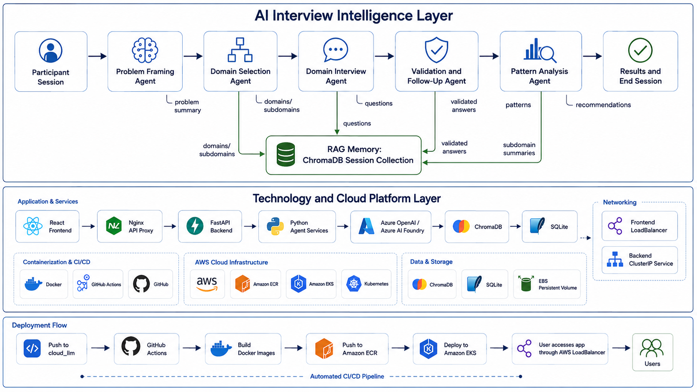
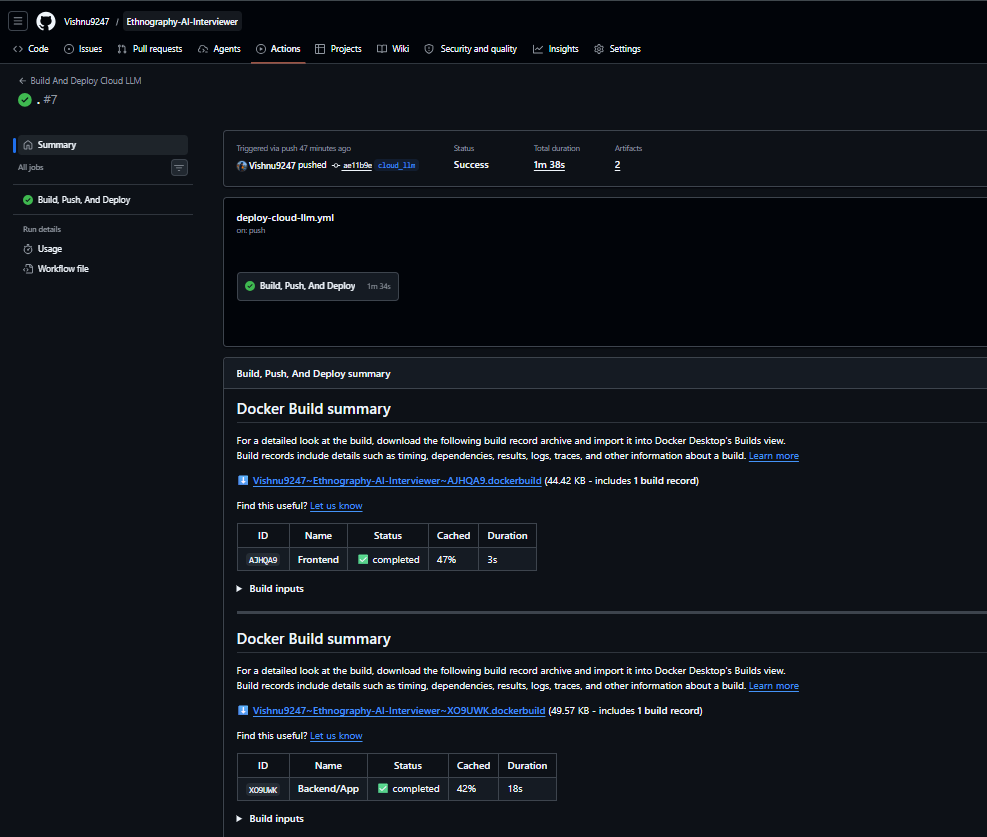
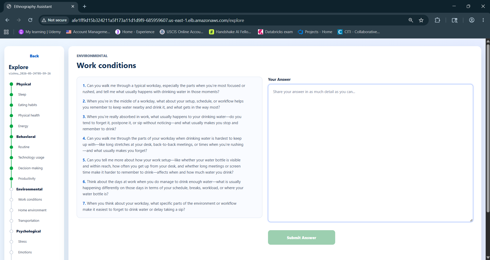
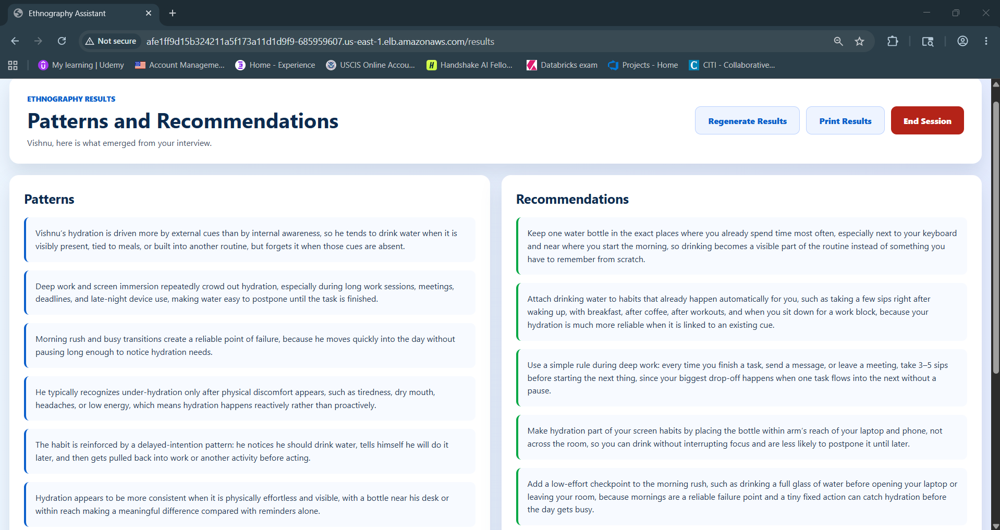

# Ethnography AI Interviewer

Ethnography AI Interviewer is a cloud-deployed AI interview platform that helps people describe a problem, explore the surrounding life context, and receive patterns and recommendations from a structured qualitative interview.

The application is designed around a multi-agent workflow. Instead of asking a fixed list of questions, it adapts to the participant's answers, chooses relevant domains to explore, validates whether answers are complete, stores context in retrieval memory, and generates a final synthesis.

## Architecture



The architecture is split into three connected parts:

- **Interview intelligence:** participant session, problem framing, domain selection, domain interview, validation, RAG memory, pattern analysis, and final results.
- **Application platform:** React, Nginx, FastAPI, Python agent services, Azure OpenAI, ChromaDB, SQLite, Kubernetes networking, and persistent storage.
- **Deployment flow:** push to `cloud_llm`, GitHub Actions build, Docker images, Amazon ECR, Amazon EKS deployment, and user access through an AWS LoadBalancer.


## What Is Ethnography?

Ethnography is a qualitative research method used to understand people, behaviors, environments, routines, and decision-making in context. Rather than only asking what someone thinks, ethnography tries to understand how people actually experience a situation in everyday life.

In a traditional ethnographic interview, a researcher might ask open-ended questions such as:

- What usually happens when this problem appears?
- What routines, pressures, or environments shape the behavior?
- What makes the problem easier or harder to manage?
- What emotions, constraints, or social factors are involved?

This project brings that style of inquiry into an AI-assisted application. The goal is not to replace the researcher, but to make exploratory interviews more structured, adaptive, and easier to analyze.

## What This Project Does

The app guides a participant through an end-to-end interview:

1. The participant enters their name and age.
2. The app creates a unique `session_id`.
3. The backend creates a temporary ChromaDB collection for that session.
4. The participant describes the problem they want to explore.
5. A problem-framing agent asks clarifying questions until the problem is clear.
6. A domain-selection agent chooses relevant domains and subdomains.
7. A domain-interview agent generates questions for each active subdomain.
8. A validation agent checks answers and asks follow-up questions when needed.
9. Completed summaries are stored in retrieval memory.
10. A pattern-analysis agent generates patterns and recommendations.
11. The user can regenerate results, print them, or end the session.
12. Ending the session deletes the temporary ChromaDB collection.

## How The App Works

At a high level, the system has two layers:

- **AI Interview Intelligence Layer:** the multi-agent interview process, RAG memory, validation, pattern extraction, and recommendations.
- **Technology And Cloud Platform Layer:** the React frontend, FastAPI backend, Azure OpenAI, ChromaDB, SQLite, Docker, GitHub Actions, Amazon ECR, and Amazon EKS deployment.

The frontend is the participant-facing interview workspace. The backend coordinates the agents, stores session data, calls Azure OpenAI, and manages retrieval memory. Kubernetes runs the frontend and backend containers in AWS, while GitHub Actions builds and deploys each new version.

## Technical Implementation-

### Frontend

The frontend is built with React and Vite. It provides the participant-facing workflow:

- Welcome and session creation.
- Problem-framing input.
- Domain and subdomain exploration.
- Question and answer workspace.
- Results page with regenerate, print, and end-session actions.

In production, the React app is served by Nginx. Nginx also proxies `/api` calls to the backend service inside Kubernetes.

### Backend

The backend is built with Python and FastAPI. It exposes routes for:

- Agent workflows.
- ChromaDB vector-store operations.
- SQLite database operations.
- Health checks and service coordination.

FastAPI receives JSON payloads from the frontend, validates them with Pydantic models, invokes the appropriate agent workflow, and returns structured JSON responses.

### Multi-Agent Workflow

The backend uses focused agents instead of one large prompt.

| Agent | Responsibility | Route |
| --- | --- | --- |
| Problem Framing Agent | Clarifies the user's problem and determines whether follow-up context is needed. | `POST /agent/problem-framing` |
| Domain Selection Agent | Selects relevant domains and subdomains for exploration. | `POST /agent/domain-selection` |
| Domain Interview Agent | Generates questions for the current domain and subdomain. | `POST /agent/start-domain-interview` |
| Validation Agent | Checks whether answers are complete and generates follow-up questions if needed. | `POST /agent/validate-domain-answer` |
| Pattern Analysis Agent | Generates final patterns and recommendations. | `POST /agent/pattern-analysis` |

Each agent receives a state object, updates the state, and returns the next step to the frontend.

### RAG And Memory

The project uses retrieval-augmented generation to preserve useful context across the interview.

| Memory Type | Technology | Purpose |
| --- | --- | --- |
| Vector memory | ChromaDB | Stores the initial problem and completed subdomain summaries for semantic retrieval. |
| Structured memory | SQLite | Stores session details, conversations, patterns, and recommendations. |

Each session has its own ChromaDB collection. This keeps session context isolated and allows cleanup when the user ends the session.

### Azure OpenAI

The backend uses Azure OpenAI through the Azure-specific `AzureOpenAI` client. Runtime configuration is provided through Kubernetes secrets.

Recommended values:

```text
AZURE_OPENAI_ENDPOINT=https://ethnography-llm-endpoint.cognitiveservices.azure.com/
AZURE_OPENAI_DEPLOYMENT=gpt-5.4-mini
AZURE_OPENAI_API_VERSION=2024-12-01-preview
AZURE_OPENAI_MODEL=gpt-5.4-mini
```

Azure metrics are used to monitor request volume and token usage.


### CI/CD And Cloud Deployment

The project deploys automatically through GitHub Actions when code is pushed to the `cloud_llm` branch.

The workflow:

1. Configures AWS credentials from GitHub Secrets.
2. Builds the backend Docker image.
3. Builds the frontend Docker image.
4. Pushes both images to Amazon ECR.
5. Creates or reuses the Amazon EKS cluster.
6. Creates or updates Kubernetes secrets.
7. Applies Kubernetes manifests.
8. Updates the backend and frontend deployments.
9. Waits for rollout and prints the frontend service.



### Cost Control

EKS clusters continue billing while the control plane exists. To stop EKS billing when the app is not being used, run the manual GitHub Actions workflow:

```text
Actions -> Destroy EKS Cluster
```

Type `destroy` when prompted. This removes the EKS cluster and related eksctl CloudFormation stacks while keeping the ECR repositories and Docker images. The next push to `cloud_llm` recreates the cluster and redeploys the app through the normal deployment workflow.

### Runtime Infrastructure

| Layer | Technology |
| --- | --- |
| Frontend UI | React, Vite |
| Frontend runtime | Nginx |
| Backend API | Python, FastAPI, Pydantic |
| Agent logic | Python agent workflows |
| LLM provider | Azure OpenAI / Azure AI Foundry |
| Vector memory | ChromaDB |
| Structured database | SQLite |
| Containers | Docker |
| Registry | Amazon ECR |
| Orchestration | Amazon EKS / Kubernetes |
| Persistent storage | EBS-backed Kubernetes PVC |
| CI/CD | GitHub Actions |
| Secrets | GitHub Secrets and Kubernetes Secrets |

## API Overview

| Route | Purpose |
| --- | --- |
| `POST /vector/create` | Creates a ChromaDB collection for a session. |
| `POST /vector/add_problem` | Stores the user's initial problem in vector memory. |
| `POST /vector/add_docs` | Stores completed subdomain summaries. |
| `POST /vector/get_docs` | Retrieves relevant context from ChromaDB. |
| `POST /vector/delete_collection` | Deletes the session's temporary vector collection. |
| `POST /database/add-session-details` | Records participant and session metadata. |
| `POST /database/add-problem-conversation` | Records answers for domains and subdomains. |
| `POST /database/add-session-results` | Stores final patterns and recommendations. |
| `GET /database/session-results/{session_id}` | Retrieves saved session results. |
| `POST /agent/problem-framing` | Runs the problem-framing agent. |
| `POST /agent/domain-selection` | Runs the domain-selection agent. |
| `POST /agent/start-domain-interview` | Starts the domain interview workflow. |
| `POST /agent/validate-domain-answer` | Validates answers and returns follow-ups or completion. |
| `POST /agent/pattern-analysis` | Generates final patterns and recommendations. |

## Repository Structure

```text
Ethnography-AI-Interviewer/
  Backend/
    App/
      api/routes/          FastAPI route handlers
      database_utils/      SQLite persistence
      general_utils/       Logging utilities
      llm_utils/           Agent workflows and Azure OpenAI client
      prompt_utils/        Prompt templates
      rag_utils/           ChromaDB service
      main.py              FastAPI entrypoint
      Dockerfile           Backend image definition
  Frontend/
    src/
      api/                 API client
      components/          Reusable UI components
      pages/               App screens
      utils/               Session, domain, result, and text helpers
    Dockerfile             Frontend image definition
    nginx.conf.template    Nginx config template
  Deployment/
    eks-cluster.yaml       EKS cluster config
    k8s-app.yaml           Kubernetes app manifests
    README.md              Deployment guide
  docs/images/             README images and screenshots
  .github/workflows/
    deploy-cloud-llm.yml   CI/CD workflow
```

## Required Secrets

GitHub Actions expects these repository secrets:

```text
AWS_ACCESS_KEY_ID
AWS_SECRET_ACCESS_KEY
AZURE_OPENAI_API_KEY
AZURE_OPENAI_ENDPOINT
AZURE_OPENAI_DEPLOYMENT
AZURE_OPENAI_API_VERSION
AZURE_OPENAI_MODEL
```

Kubernetes injects these values into the backend through the `ethnography-backend-secrets` secret.

## Local Development

Start the backend:

```bash
cd Backend
uvicorn App.main:app --reload
```

Start the frontend:

```bash
cd Frontend
npm install
npm run dev
```

The Vite development server proxies `/api` calls to the local backend.

## Web App Gallery

### Domain Exploration

The exploration screen shows the selected domains and subdomains in a left-side progress timeline. The active subdomain appears in the main workspace with generated questions and a large answer box.



### Results Page

The results page separates inferred behavioral patterns from practical recommendations. Users can regenerate, print, or end the session.



### End Session

The final screen confirms that the session is closed and allows the participant to start again.


